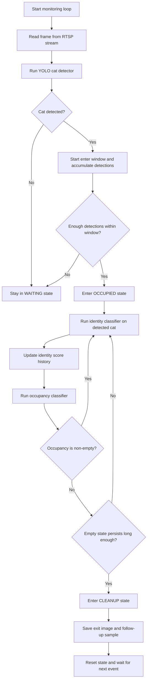

# MLOps Cat Demo

This is a lightweight MLOps and computer vision project for cat recognition and toilet behavior monitoring. The project uses YOLO to detect cats and uses classification models to identify individual cats and infer toilet state, forming a complete pipeline from data collection to training and real-time inference.

## Project Goal

The main goals of this project are:

- Automatically capture cat images from an RTSP camera or a video file.
- Train a classification model to recognize different cats such as cat_a and cat_b.
- Train a second classification model to determine whether the toilet is empty or non-empty.
- Monitor cats entering or leaving the toilet and save related event images.

It covers both data engineering and model inference workflows, making it suitable as a small AI demo or an MLOps learning example.

## Project Structure

- [src/data](src/data): Data collection and dataset preparation scripts
  - [src/data/collect_cat.py](src/data/collect_cat.py): Collect cat images from an RTSP camera into [dataset/pictures](dataset/pictures)
  - [src/data/collect_cat_from_video.py](src/data/collect_cat_from_video.py): Collect cat images from a video file into [dataset/pictures](dataset/pictures)
  - [src/data/split_dataset.py](src/data/split_dataset.py): Split collected pictures into training and validation sets under [dataset/processed](dataset/processed)
- [src/training](src/training): Training scripts
  - [src/training/train_cat_classifier.py](src/training/train_cat_classifier.py): Train the cat classification model
- [src/monitoring](src/monitoring): Monitoring scripts
  - [src/monitoring/toilet_monitor.py](src/monitoring/toilet_monitor.py): Detect cats entering or leaving the toilet and save event samples
- [dataset](dataset): Main dataset root containing [dataset/pictures](dataset/pictures), [dataset/video](dataset/video), and [dataset/processed](dataset/processed)
- [toilet_events](toilet_events): Event output directory generated by the monitoring script
- [models](models): Saved and previously trained model results

## Main Workflow

1. Data collection
   - Automatically detect cats from an RTSP camera or video and crop the cat image.
   - The generated pictures are saved under class folders inside [dataset/pictures](dataset/pictures).
   - Input videos for the video collector are expected under [dataset/video](dataset/video).

2. Dataset splitting
   - Split the collected pictures by class into training and validation sets and output them under [dataset/processed](dataset/processed).

3. Model training
   - Use YOLO image classification models to train two classifiers:
   - identity: Identify cat identity such as cat_a / cat_b
   - occupancy: Determine toilet occupancy state such as Empty / Non-empty

4. Monitoring
   - Run the toilet monitoring script to detect whether a cat enters or leaves and save event images.

## Environment Setup

It is recommended to create a virtual environment in the project root and install the dependencies:

```bash
python -m venv .venv
source .venv/bin/activate
pip install -r requirements.txt
```

Required dependencies include:

- ultralytics
- opencv-python
- numpy
- PyYAML

## Usage

All scripts are intended to be run from the project root.

### 1. Collect training data

#### From an RTSP camera

```bash
python src/data/collect_cat.py --label cat_a --target 300
```

Arguments:

- `--label`: Data label such as `cat_a`, `cat_b`, or `empty`
- `--target`: Number of images to collect

The script requires you to set the RTSP address in [configs/config.yaml](configs/config.yaml):

```yaml
camera:
  rtsp_url: rtsp://<username>:<password>@<ip>:<port>/...
```

There is no built-in default RTSP URL, so this value must be configured before running the collection or monitoring scripts.

#### From a video file

```bash
python src/data/collect_cat_from_video.py --video /path/to/video.mp4 --label cat_b --interval 0.5
```

### 2. Split the dataset

You can split collected pictures located under [dataset/pictures](dataset/pictures) into [dataset/processed/train](dataset/processed/train) and [dataset/processed/val](dataset/processed/val) using:

```bash
python src/data/split_dataset.py
```

Alternatively, use the convenience runner to split and train in one step (recommended):

```bash
python src/execute_train_cat_classifier.py --task all
```

The split script reads class folders from [dataset/pictures](dataset/pictures) and creates [dataset/processed/train](dataset/processed/train) and [dataset/processed/val](dataset/processed/val).

### 3. Train the classification models

Use the runner to split processed data then start training in one command:

```bash
python src/execute_train_cat_classifier.py --task all
```

Or run the training script directly (requires [dataset/processed/train](dataset/processed/train) and [dataset/processed/val](dataset/processed/val) to exist):

```bash
python src/training/train_cat_classifier.py --task all --dataset dataset/processed
```

The training script uses the YOLO image classification model and saves results under `models/cat_classifier/identity` and `models/cat_classifier/occupancy`.

The processed dataset under [dataset/processed](dataset/processed) must contain:
- `empty` in both `train/` and `val/`
- at least one additional non-empty class in both `train/` and `val/`
- identity class folders matching the configured identity classes in [configs/config.yaml](configs/config.yaml) in both `train/` and `val/`

### 4. Monitor cats entering or leaving the toilet

```bash
python src/monitoring/toilet_monitor.py
```

This script uses two models to perform more advanced logic:

- Use YOLO to determine whether a cat is present in the frame.
- Use the identity classifier to decide which cat is in the toilet.
- After the cat leaves, use the occupancy classifier to determine whether the toilet is empty or non-empty.
- Save event images under [toilet_events](toilet_events).
- Send a notification with `cat.jpg` and `after_2s.jpg` attached when a complete toilet event is detected.

Notification settings are configured in [configs/config.yaml](configs/config.yaml) under the `notification` section. The project supports two modes:

- `mail` — send email notifications with the final event image attached
- `discord` — send a Discord webhook message with the final event image attached

#### Discord setup
1. In Discord, open the channel settings and go to `Integrations` → `Webhooks`.
2. Create or copy an existing webhook and copy the full webhook URL.
3. Set `notification.mode` to `discord` and configure `notification.discord`:

```yaml
notification:
  mode: discord
  discord:
    webhook_url: https://discord.com/api/webhooks/WEBHOOK_ID/WEBHOOK_TOKEN
    username: "Toilet Monitor"
    avatar_url: ""
    content_template: "{cat_name} used the toilet"
```

4. Run the monitor script:

```bash
python src/monitoring/toilet_monitor.py
```

When a complete toilet event is detected, the system will post the event to your Discord webhook.

#### Mail setup
If you use email instead, configure the SMTP settings and recipients in `configs/config.yaml`:

```yaml
notification:
  mode: mail
  mail:
    recipients:
      - example@example.com
    smtp_server: smtp.example.com
    smtp_port: 587
    smtp_username: user@example.com
    smtp_password: secret
    from_email: user@example.com
    use_tls: true
    use_ssl: false
    subject_template: "{cat_name} used the toilet"
    body_template: "A cat used the toilet. See attached image for this event."
```

Then run:

```bash
python src/monitoring/toilet_monitor.py
```

### Monitoring logic overview

The monitoring loop can be understood as a simple state machine with three stages: waiting, occupied, and cleanup.



In practice, the script behaves like this:

- In the WAITING state, it watches for a cat entering the toilet area.
- Once the enter window is confirmed, it transitions to OCCUPIED and starts collecting identity evidence.
- While occupied, it keeps classifying the cat identity and monitoring occupancy.
- If occupancy eventually indicates the toilet is empty for a sustained period, it transitions to CLEANUP and saves event images for review.

## Training Results and Outputs

- Trained model weights are stored under `models/cat_classifier/identity` and `models/cat_classifier/occupancy`.
- Previous or historical training results can be viewed under [models](models).
- The monitoring script creates event folders organized by date and time under [toilet_events](toilet_events).
- Each event directory may contain files such as `cat.jpg` and `after_2s.jpg`.

## Notes and Considerations

- This project currently depends on an RTSP video stream, so a reachable camera address is required.
- If you do not have a camera, you can first collect data from a video file.
- The training script uses GPU 0 by default. If your machine does not have a GPU, update the `device` setting in the script.
- Because the project relies on YOLO and OpenCV, it is recommended to run it in a Python 3.9+ environment.

## Suitable Use Cases

- Home cat recognition demo
- Cat behavior monitoring experiments
- Simple MLOps pipeline demonstration with computer vision
- An introductory YOLO + Ultralytics + OpenCV project
